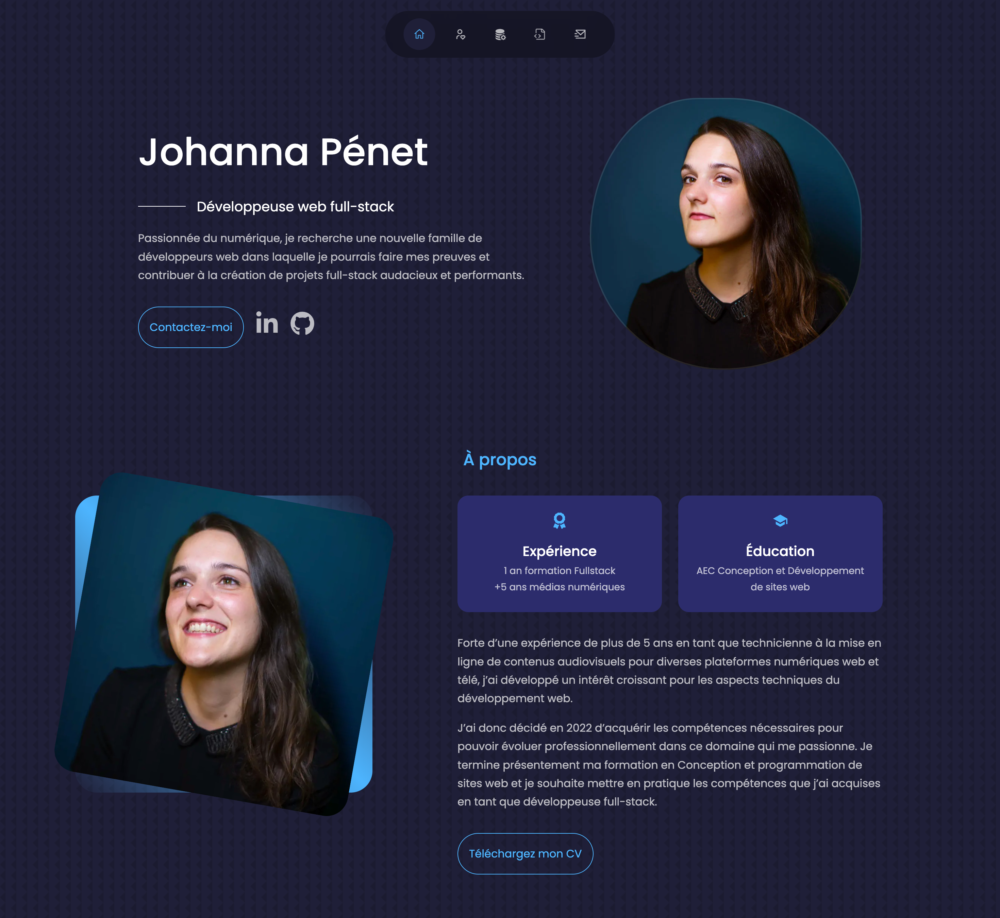

# Portfolio

<!-- TABLE OF CONTENTS -->
<details>
  <summary>🏁 Sommaire</summary>
  <ol>
    <li><a href="#-intro">Intro</a></li>
    <li><a href="#-quickstart">Quickstart</a></li>
    <li><a href="#-features">Features</a></li>
    <li><a href="#-built-with">Built with</a></li>
  </ol>
</details>

## ⚡ Intro

Création d'un portfolio personnel avec React pour présenter mon parcours et mes projets académiques et personnels.

Les librairies utilisées : emailjs et react-icons.

Lien vers le projet live : [portfolio](https://johannapenet.com/)

## 🚀 Quickstart

Installez les dépendances définies dans 'package.json' à la racine du projet et démarrer le serveur :

```bash
npm install
npm start
```

## 🎯 Features

Portfolio monopage composé de plusieurs sections :
- Introcution
- À propos
- Compétences
- Projet
- Contact

## 🤖 Built With


## 🌐 Screenshots

